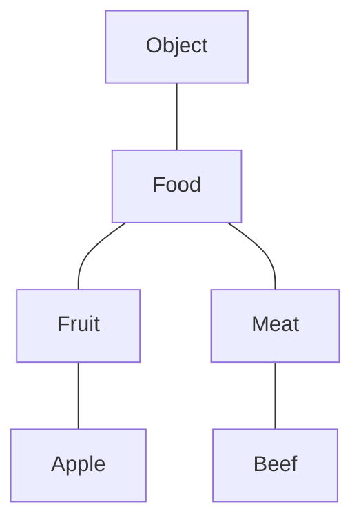

> 首先，Java有泛型这一个概念，初衷是为了保证在运行时出现的错误能提早放到编译时检查。有了这个前提，再来看看题主的问题。


先说一下java中的**协变，逆变，不可变**:


java 中`String`  继承`Object` ,我么记为：String ≦ Object


假设有如下类：

```java
class Food{} // 默认继承Object
class Fruit extends Food{}
class Meat extends Food {}

class Apple extends Fruit{}
class Beef extends Meat{}


```





# 逆变与协变

Java中String类型是继承自Object的，姑且记做String ≦ Object，表示String是Object的子类型，String的对象可以赋给Object的对象。而Object的数组类型Object[]，理解成是由Object构造出来的一种新的类型,可以认为是一种构造类型，记f(Object)，那么可以这么来描述协变和逆变：

- 当A ≦ B时,如果有f(A) ≦ f(B),那么f叫做协变；
- 当A ≦ B时,如果有f(B) ≦ f(A),那么f叫做逆变；
-  如果上面两种关系都不成立则叫做不可变。

例如数组是斜变得：

```java
Food food = new Fruit();  
// or
food = new Meat(); // 即 把子类赋值给父类引用

Fruit [] arrFruit = new Fruit[3];
Food [] arrFood = arrFruit; // 数组协变的
    
```


java 的泛型是不可变的：

```java
List<Beef> beefList = new ArrayList<>();
List<Food> foodList = beefList; //错误：不可协变  
beefList = foodList; // 错误 ： 不可逆变

eat(beefList);// 错误：：不可协变  

public void addFood(List<Food> list){
    list.add(new Apple());
}

```

为什么不能把`beefList` 作为参数传递给 `addFood(List<Food> list)  `  方法呢？这儿我们用反正法类证明：

1. `addFood` 方法接收`List<Food> list` 的类型参数，那么在`addFodd` 方法中能给 传递进来的`List` add  任何`Food` 的子类型。那么，既然`eat(beefList)` 这行代码没有问题，也就意味着能通过`addFood` 方法给 `beefList`  里面增加任何 `Food` 的子类型（比如：` list.add(new Apple())`）.
2. 通过第一步，我们给 装肉`beefList` 里面加了一个苹果（Apple）, 那么从`beefList`  get 数据赋值给`Beef` 的时候（`Beef beef = beefList.get(0)`）就会发生类型转换异常 ，因为取出来的是一个`Apple`,  这样明显有问题了。

因此：得出java中泛型是不变得，既不能协变，也不能逆变。


# 泛型中的通配符实现协变与逆变

JAVA中泛型是不变的，可有时需要实现逆变与协变，怎么办呢？这时就需要通配符?。


 `<? extends E>`实现了泛型的协变，比如：


```java
List<? extends Food> foodList = new ArrayList<>();
List<Apple> appleList = new ArrayList<>();
foodList = appleList; // ok 协变

foodList.add(new Beef()); // 错误 不能执行添加null 以外的操作
foodList.add(new Food());// 错误，同上，
foodlist.add(new Apple()); // 错误，同上

Food food = foodList.get(index); //ok, 把子类引用赋值给父类显然是可以的
```

`<？ extends Food>` 指明了上界，即表示了集合中存放的对象是 `Food` 或者`Food` 的子类，因此`foodList` 就表示了一个存放  `Food` 或者`Food` 的子类的集合，`appleList` 集合就是一个存放`Food` 的子类 `Apple`的集合， 因此可以把 `appleList` 赋值给 `foodList`,但是不能对`foodList` 添加除`null` 以外的任何对象。为什么不能添加呢？其实很简单，如果可以允许的话，那么`foodList` 就可以添加`Food` 或者`Food` 的子类型，那么上面代码中在`foodList = appleList;`  赋值后，执行`foodList.add(new Beef());` 操作就会导致给 `appleList` 里面添加了一个`Beef` 对象，显然这样是不对的。因此可以得出结论：

**<? extends E> 是支持协变得，但是不能执行添加null 以外的其他添加操作，即基本上就是只能读，不能写，因此<? extends E> 一般用于读操作。** 


 `<? Super E>`实现了泛型的逆变，比如：

```java
List<? super Fruit> fruitList = new ArrayList<>();
List<Food> foodList = new ArrayList<>();
fruitList = foodList; // ok 逆变

foodList.add(new Meat()); 

fruitList.add(new Apple()); // ok，只能添加 Fruit 或者 其子类
fruitList.add(new Food());// error, 只能添加 Fruit 或者 其子类

Fruit fruit = fruitList.get(0); // error，get出来的元素是Object类型
Object obj = fruitList.get(0)；// ok 
```


`<? super Fruit>` 指明了下界，即表示了集合中存放的对象只能是 `Fruit` 或者其父类，因此`fruitList` 表示了一个存放`Fruit` 或者其父类的集合，那么就可以把一个`Fruit` 父类`Food` 的集合`foodList` 赋值给 `fruitList`(即：`fruitlist = foodList`)，这儿可能有的人就有点疑问了？`<? super Fruit>` 指明了集合存放的对象是`Fruit` 或者其父类,那为什么往集合中添加`Fruit`的父类元素不行呢（`fruitList.add(new Food())`）？同样我们用反正法来说明，假如可以向`<? super E>` 集合中添加 `E` 的父类，那么就可以向`fruitList` 添加`Fruit` 的父类（`Food` or `Object`)，在本例中，我们把`foodList` 赋值给了`fruitList`(`fruitList = foodList`),既然可以添加父元素，那么我们执行`fruitList.add(new Food)` 就相当于给 `foodList`集合里面添加了一个`Food`元素，这看起来没有什么问题，因为`foodList` 本来就是用来装`Food` 元素的，但是如果我们添加的`Fruit` 父类是`Object` 对象（或者一个`Fruit` 实现的和`Food` 无关的接口，又或者`Food`继承的一个其他类`B`,那么`B `也是 `Fruit` 的父类），那么就意味着给`foodList` 里面添加了和`Food` 无关的类，这样显然是不行的。那么为什么往`fruitList` 里面添加`Fruit`或者其子类 元素是可以的，因为`fruitList` 表示的就是一个存放`Fruit` 或者其父类的集合，所以这个集合肯定就能装`Fruit` 或者其子类，比如上面把`foodList` 赋值给`fruitList` 后，往`fruitList` 里面添加 `Apple` 就相当于往`foodList` 里面添加`Apple`,显然是可以的，对于`get` 操作时为什么读取出来的是`Object` ，是因为 `fruitList` 集合表示的存放`Fruit` 或者其父类的集合，而`Fruit` 的父类可能有很多，在本例中由于我们知道存的是`Food`（`fruitList = foodList`）, 但是在实际中，谁知道在运行时到底存的是哪一个呢？因此为了安全全部定义为`Object` 类型。因此得出结论：

**`<? super E>` 支持逆变，能往集合中添加`E` 或者E子类的对象。不能添加E的任何父类对象，读取时的对象为Object 类型，因此<? super E> 一般用于写操作**


****